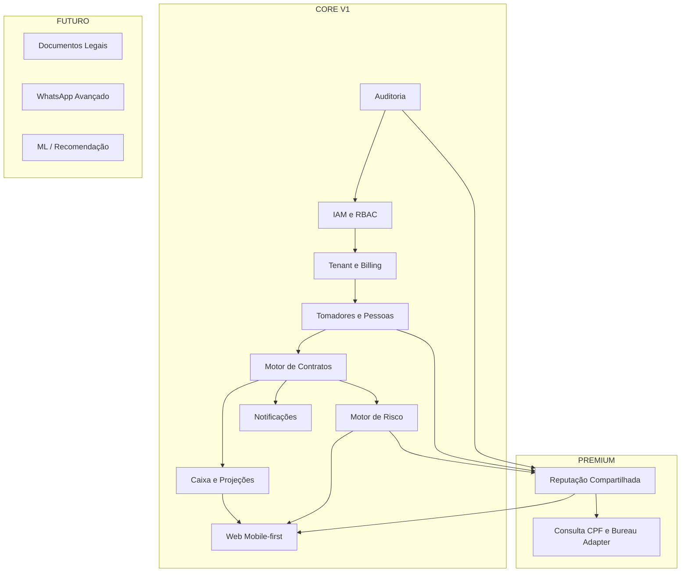
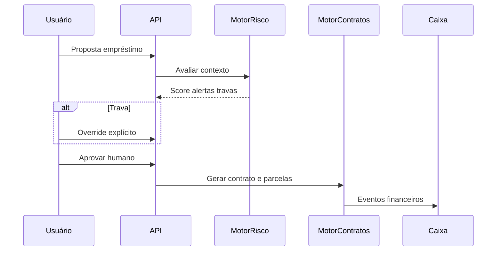

# Master Plan - SaaS de Gestao de Emprestimos Pessoais (Brasil)

## Resumo executivo (1 pagina)

### Contexto e objetivo

- Produto SaaS multiempresa para gestao de emprestimos pessoais no Brasil, com foco inicial em pessoas fisicas credoras.
- Hospedagem fora do Brasil, exigindo governanca reforcada de privacidade e transferencia internacional de dados.
- Prioridades de negocio (ordem): organizar operacao -> dar visao clara de lucro/caixa -> criar diferencial por reputacao/score compartilhado.

### Escopo recomendado de lancamento

- Lancar com `CORE V1`: contratos parametrizaveis, parcelas/recebimentos, caixa e projecao, dashboard mobile-first, risco hibrido com override humano, notificacoes por e-mail, RBAC e auditoria.
- Tratar reputacao compartilhada como `PREMIUM` separado, com ativacao progressiva e controles reforcados.
- Manter capacidades `FUTURO` previstas em arquitetura (WhatsApp ampliado, ML de risco, documentos adicionais), sem acoplamento prematuro.

### Decisoes arquiteturais-chave

- Arquitetura principal: **monolito modular com eventos internos**.
- Justificativa: melhor equilibrio entre velocidade, consistencia financeira, custo operacional e caminho de evolucao sem reescrita.
- Estrategia de dados: PostgreSQL como fonte da verdade, tenant_id obrigatorio, invariantes de dominio, constraints e transacoes explicitas.

### Seguranca e governanca (nao negociavel)

- Segregacao multi-tenant rigorosa no backend; frontend nao decide valores sensiveis nem permissoes.
- MFA para superficies sensiveis, RBAC granular, auditoria imutavel para CPF, risco e override.
- Protecao de dados sensiveis com minimizacao, criptografia, mascaramento de logs e deteccao de abuso.
- Modulo de reputacao cross-tenant nominal classificado como `PRECISA DE VALIDACAO` juridica antes de ativacao.

### Monetizacao recomendada

- Modelo hibrido: assinatura por tenant (base previsivel) + add-ons + consumo no PREMIUM (protege margem de custos variaveis).
- Transparencia de limites por plano e politicas de excedente para evitar erosao de margem e surpresa de custo.

### Riscos executivos principais

- Juridico/regulatorio do compartilhamento nominal de reputacao entre tenants.
- Erro de modelagem financeira no motor de contratos se governanca de versao nao for estrita.
- Abuso em consultas de CPF sem cotas, trilha de auditoria e controles de acesso robustos.

### Recomendacao executiva final

- Aprovar baseline do `master-plan` e iniciar implementacao apenas com `CORE V1`, mantendo PREMIUM em modo seguro ate validacao juridica.
- Usar gates Go/No-Go antes de codar: arquitetura, seguranca, dados, juridico, operacao, testes e monetizacao.
- Quando decidir iniciar execucao, emitir comando explicito: **AUTORIZO CODAR + escopo da sprint 1**.

**Versão do documento:** 1.2  
**Status:** fonte de verdade do projeto (planejamento; sem código de produção até autorização explícita)  
**Última atualização:** 2026-06-23

**Legenda de classificação:** `CORE V1` · `PREMIUM` · `FUTURO` · `PRECISA DE VALIDAÇÃO`

---

## Índice detalhado

| #   | Seção                                                                                                   | Escopo principal                        |
| --- | ------------------------------------------------------------------------------------------------------- | --------------------------------------- |
| 1   | [Visão executiva do produto](#1-visão-executiva-do-produto)                                             | Problema, proposta de valor, público    |
| 2   | [Objetivos de negócio e prioridades](#2-objetivos-de-negócio-e-prioridades)                             | Ordem de prioridades do negócio         |
| 3   | [Escopo do v1 robusto e fronteiras](#3-escopo-do-v1-robusto-e-fronteiras-do-produto)                    | O que entra no v1 vs depois             |
| 4   | [Premissas, restrições e dúvidas](#4-premissas-restrições-e-dúvidas-em-aberto)                          | Premissas, LGPD, hospedagem, incertezas |
| 5   | [Mapa de módulos do sistema](#5-mapa-de-módulos-do-sistema)                                             | Módulos e dependências                  |
| 6   | [Perfis de usuário e permissões](#6-perfis-de-usuário-e-permissões)                                     | RBAC, papéis, princípios                |
| 7   | [Fluxos principais do negócio](#7-fluxos-principais-do-negócio)                                         | Jornadas e estados                      |
| 8   | [Requisitos funcionais detalhados](#8-requisitos-funcionais-detalhados)                                 | RF por área                             |
| 9   | [Requisitos não funcionais](#9-requisitos-não-funcionais)                                               | Performance, disponibilidade, i18n      |
| 10  | [Modelo de assinatura e monetização](#10-modelo-de-assinatura-e-opções-de-monetização)                  | Planos, add-ons, comparação             |
| 11  | [Arquitetura de alto nível](#11-arquitetura-de-alto-nível)                                              | Visão lógica, deploy e stack candidata  |
| 12  | [Comparação de arquiteturas candidatas](#12-comparação-de-arquiteturas-candidatas-e-recomendação-final) | Matriz de decisão                       |
| 13  | [Estratégia multi-tenant](#13-estratégia-multi-tenant)                                                  | Isolamento, billing, dados              |
| 14  | [Estratégia de dados e entidades](#14-estratégia-de-dados-e-entidades-principais)                       | Modelo conceitual, SQL vs grafo         |
| 15  | [Motor de contratos](#15-estratégia-de-cálculo-financeiro-e-motor-de-contratos)                         | Parametrização, extensibilidade         |
| 16  | [Caixa e projeção](#16-estratégia-de-caixa-e-projeção-financeira)                                       | Carteiras, fechamentos, fluxo           |
| 17  | [Motor de risco](#17-motor-de-risco)                                                                    | Regras, score, override                 |
| 18  | [Reputação compartilhada (PREMIUM)](#18-módulo-premium-de-reputação-compartilhada)                      | CPF, governança, alternativas           |
| 19  | [Integrações externas](#19-integrações-externas)                                                        | Billing, e-mail, WhatsApp, bureau       |
| 20  | [Segurança, privacidade, auditoria](#20-segurança-privacidade-auditoria-e-antifraude)                   | Criptografia, MFA, trilhas              |
| 21  | [Observabilidade e rastreabilidade](#21-observabilidade-logs-e-rastreabilidade)                         | Logs, métricas, consultas CPF           |
| 22  | [UX/UI mobile-first](#22-uxui-e-estratégia-mobile-first)                                                | Dashboard, personalização               |
| 23  | [Infraestrutura e escalabilidade](#23-estratégia-de-infraestrutura-deploy-e-escalabilidade)             | Deploy, DR, ambientes                   |
| 24  | [Testes e qualidade](#24-estratégia-de-testes-e-qualidade)                                              | Pirâmide, contratos financeiros         |
| 25  | [Roadmap por fases](#25-estratégia-de-roadmap-por-fases)                                                | Fases entregáveis                       |
| 26  | [Dependências, riscos e mitigação](#26-dependências-críticas-riscos-e-mitigação)                        | Regulatório, técnico, operacional       |
| 27  | [Critérios para começar a codar](#27-critérios-de-prontidão-para-começar-a-codar)                       | Gates antes de implementação            |
| 28  | [Próximos passos e pendências](#28-próximos-passos-e-pendências)                                        | Lista viva                              |
| —   | [Regras persistentes mínimas do projeto](#regras-persistentes-mínimas-do-projeto)                       | Governança de engenharia                |
| —   | [Registro Docs-first](#registro-docs-first)                                                             | Fontes técnicas e implicações           |

---

## 1. Visão executiva do produto

### 1.1 Problema estruturado

Credores pessoais físicos no Brasil operam emprestimos informais ou semi-formais com alto risco operacional: controle de caixa frágil, contratos heterogêneos (frequência de pagamento, juros, carência, multa/mora), baixa visibilidade de lucro real vs fluxo de caixa, e ausência de sinalização de risco reprodutível entre operações. Operações maiores (pequenos escritórios, famílias de credores) sofrem os mesmos problemas em escala.

### 1.2 Proposta de valor

SaaS **multiempresa** (`Tenant` = assinante/operação) que:

- Organiza a operação de empréstimos pessoais com **motor de contratos parametrizável** (sem lógica financeira espalhada e rígida).
- Entrega **visão clara de lucro e caixa** com projeções e fechamentos configuráveis.
- Oferece, como diferencial **PREMIUM**, módulo de **reputação compartilhada** (“score interno” entre tenants), com governança forte e validação jurídica prévia à implementação real de compartilhamento nominal.

### 1.3 Contexto e restrições de produto

| Dimensão           | Definição                                                                                                       |
| ------------------ | --------------------------------------------------------------------------------------------------------------- |
| País               | Brasil (regras de negócio e compliance focados em LGPD e práticas locais)                                       |
| Público-alvo       | **Pessoa física** credora (caso de borda: MEI). Operações pequenas e informais.                                 |
| Modelo de uso      | **1 usuário por conta** (single-session). Compartilhamento de senha é responsabilidade do usuário, não feature. |
| Hospedagem         | Fora do Brasil (implica latência, transferência internacional de dados, contratos e DPIA)                       |
| Monetização        | Assinatura mensal por níveis de plano com **WhatsApp** como canal principal de cobrança                         |
| Decisão de crédito | **Sempre humana**; sistema recomenda, alerta, trava (configurável por contrato) e registra **override**         |

**Classificação:** núcleo operacional e financeiro `CORE V1`; reputação compartilhada `PREMIUM` + `PRECISA DE VALIDAÇÃO`.

---

## 2. Objetivos de negócio e prioridades

Ordem explícita de prioridade do negócio:

1. **Organizar a operação** — cadastros, contratos, parcelas, recebimentos, renegociações, trilha auditável.
2. **Lucro e caixa visíveis** — indicadores e projeções confiáveis; fechamentos periódicos alinhados à configuração do tenant.
3. **Diferencial competitivo** — score compartilhado (módulo PREMIUM), com risco legal/operacional explicitamente gerido.

**Trade-off:** priorizar (1) e (2) maximiza adoção e reduz dependência regulatória do PREMIUM cedo; investir cedo no (3) acelera diferenciação mas aumenta exposição jurídica e custo de governança.

---

## 3. Escopo do v1 robusto e fronteiras do produto

### 3.1 CORE V1 (entrega robusta inicial)

- Multi-tenant com segregação rígida de dados e RBAC flexível.
- Tomadores, contratos, parcelas, recebimentos, renegociações, eventos de caixa.
- Motor de contratos **parametrizável** cobrindo: mensal, semanal, quinzenal; juros simples/compostos; pagamento só de juros; amortização parcial; renegociação; quitação antecipada; multa, mora, carência; extensão por novos “tipos” via configuração/versão de esquema (não hardcode único).
- Caixa: entradas, saídas, aportes, retiradas, saldo por carteira, fluxo projetado, fechamento diário/semanal/quinzenal/mensal (configurável).
- Dashboard configurável com widgets e indicadores prioritários (vide seção 8).
- Notificações por **e-mail** (parcela vencendo, vencida, contrato em atraso) com preferências por usuário.
- Arquitetura preparada para **WhatsApp** como canal futuro (fila, templates, idempotência) — envio real pode ser fase posterior.
- Motor de risco **híbrido** (regras + pesos + score + semáforo + alertas explicáveis + travas configuráveis + override); decisão final humana.
- Rede de **indicação** e uso como variável de risco; grafo de relacionamento modelado (ver seção 14).
- Integrações planejadas: gateway de assinatura, provedor de e-mail, WhatsApp Business API, burôs — com anti-acoplamento.

### 3.2 PREMIUM (módulo separado, altamente sensível)

- Busca por CPF, histórico entre tenants, score agregado, recomendação automática, contratos ativos entre tenants, históricos de pagamento e de consultas (com/sem contrato), sinalização de bom/mau pagador.
- Camada de **busca externa** avançada (Serasa Experian, SCPC, etc.) como capacidade futura plugável; monetização por assinatura/uso/híbrido.

**Fronteira:** implementação nominal cross-tenant só após **validação jurídica**; até lá, arquitetura prevê modos mais seguros (vide seção 18).

### 3.3 FUTURO (previsto na arquitetura, não obrigatório no v1)

- Confissão de dívida (geração de documento).
- Envio estruturado de comprovante de pagamento.
- WhatsApp além de aviso (cobrança conversacional, confirmações — com opt-in e políticas).
- Modelos preditivos de inadimplência e recomendação assistida (sem acoplamento prematuro a um único framework de ML).

### 3.4 Fora de escopo explícito (até nova decisão)

- Banking as a service, conta de pagamento própria, licença financeira.
- White-label na primeira fase.
- Garantir legalmente taxas/juros — o produto apoia registro e cálculo conforme parâmetros do usuário; **conformidade civil do contrato é responsabilidade do tenant** (`PRECISA DE VALIDAÇÃO` por tenant).

---

## 4. Premissas, restrições e dúvidas em aberto

### 4.1 Premissas de produto

- Usuários são majoritariamente **operacionais**, não técnicos; UX mobile-first é mandatória.
- “Lucro estimado” no dashboard depende de definição contratual e de caixa; o sistema deve separar **lucro contábil estimado** vs **margem de caixa** quando aplicável (detalhar na modelagem financeira).

### 4.2 Premissas técnicas

- Backend é **fonte da verdade** para valores, permissões, risco e estado financeiro.
- Todo payload de cliente é não confiável; regras e travas no servidor.

### 4.3 Restrições inegociáveis

- Segregação **tenant-scoped** em todas as leituras/escrituras.
- Rastreabilidade completa de **Consulta de CPF** (tenant, usuário, contexto, resultado, timestamp, correlação).
- **Override** sempre auditável; v1 sem justificativa obrigatória, arquitetura permite exigir justificativa depois.

### 4.4 Dúvidas / PRECISA DE VALIDAÇÃO

| Tema                                                | Incerteza                                                                                        | Alternativa mais segura                                                                                       |
| --------------------------------------------------- | ------------------------------------------------------------------------------------------------ | ------------------------------------------------------------------------------------------------------------- |
| Compartilhamento nominal de histórico entre tenants | Base legal LGPD, necessidade de consentimento, legítimo interesse, papel de controlador/operador | Modo agregado/tokenizado; opt-in explícito; relatório mínimo; ou apenas “sinal” sem identificação até parecer |
| Dados hospedados fora do BR                         | Transferência internacional, cláusulas contratuais, localização de backup                        | DPIA; SCCs ou mecanismo adequado; minimização; possível replicação de metadados no BR se exigido              |
| Consulta a burô                                     | Contratos com fornecedor, finalidade, retenção                                                   | Adapter pattern; cache com TTL político; sem misturar dado de bureau com dado interno sem classificação       |
| CPF como chave global cross-tenant                  | Risco de reidentificação e correlatação abusiva                                                  | Pseudonimização interna; segregação de índices; rate limit agressivo                                          |

---

## 5. Mapa de módulos do sistema

**Dependências críticas:** IAM → tudo; Contratos → Caixa e Risco; PREMIUM acoplado apenas por interfaces e eventos, para poder desligar por feature flag.

---

## 6. Usuário único e suas permissões

### 6.1 Princípio

O modelo é **single-user por conta**. Cada conta pertence a **uma pessoa física**. Não há papéis, não há RBAC granular entre usuários, não há convite.

> O titular da conta é o **único** com acesso. Compartilhamento de senha é decisão pessoal do titular — não é feature do produto e não é suportado nativamente.

### 6.2 Permissões sensíveis (todas válidas para o próprio titular)

- `cpf:consult` · `cpf:view_full` · `risk:evaluate` · `risk:override` · `risk:configure_policy`
- `cash:close_period` · `cash:reopen_period`
- `contract:write` · `contract:renegotiate`
- `premium:reputation:view_aggregated` · `premium:reputation:view_nominal`
- `billing:manage` · `audit:export` · `data:export` · `account:export` · `account:delete`

Todas essas permissões são **do próprio usuário sobre os próprios dados**. A separação é apenas lógica (flag no código), não há outro ator para limitar.

### 6.3 MFA e proteção adicional

- **MFA opcional** com banner recomendando ativar.
- **Recuperação de senha** por e-mail + celular (duplo fator).
- Sessão única: ao logar em outro dispositivo, a anterior cai.

### 6.4 Camada por funcionalidade (gate por plano)

O plano de assinatura (Seção 10) controla **funcionalidades** que o usuário pode usar, **não** papéis. Por exemplo:

- Apenas usuários do plano **Pro** ou **Ilimitado** têm `premium:reputation:view_aggregated`.
- Apenas **Ilimitado** tem `premium:reputation:view_nominal` (ver Seção 18).
- WhatsApp Business API restrito por plano (ver ADR-0019).

---

## 7. Fluxos principais do negócio

### 7.1 Cadastro de tomador e indicação

1. Usuário cria/atualiza tomador (dados mínimos + documento).
2. Opcional: registrar **Indicação** (quem indicou quem, data, contexto).
3. Evento de domínio: `PartyCreated` / `ReferralLinked`.

### 7.2 Proposta → análise de risco → contrato

1. Usuário informa valor, prazo, perfil de contrato (template parametrizado).
2. Motor de risco calcula score, semáforo, alertas explicáveis; aplica travas configuráveis.
3. Se trava: exige **override** explícito (futuro: justificativa obrigatória).
4. Decisão humana de “aprovar valor” registra estado; geração do contrato e cronograma de parcelas pelo **motor de contratos** (versão do esquema persistida no contrato).

### 7.3 Cobrança e recebimento

1. Parcelas geradas com vencimentos e valores de juros/amortização conforme motor.
2. Recebimento total/parcial aloca saldo (regras de alocação: juros, mora, principal — configurável por produto).
3. Eventos financeiros alimentam **caixa** e projeções.

### 7.4 Renegociação e quitação

1. Nova versão de termos ou novo sub-cronograma; histórico imutável de versões.
2. Quitação antecipada: recálculo conforme política do contrato; log de auditoria.

### 7.5 Consulta CPF (PREMIUM / ou interno)

1. Solicitação com contexto (ex.: “nova proposta”, “cobrança”).
2. Registro obrigatório em `ConsultaCpf` com resultado, origem (interno/bureau), correlação.
3. Políticas de retenção e visibilidade por papel.

---

## 8. Requisitos funcionais detalhados

### 8.1 Gestão de empréstimos (`CORE V1`)

- RF-01: CRUD de tomadores com validação de documentos (formato BR).
- RF-02: Contratos com **versão de esquema** de produto financeiro persistida.
- RF-03: Parcelas com estados: prevista, aberta, parcial, quitada, vencida, renegociada.
- RF-04: Recebimentos com alocação e histórico de estorno (política de estorno `PRECISA DE VALIDAÇÃO`).
- RF-05: Renegociação com cadeia de versões e impacto em caixa/projeção.
- RF-06: Multa, mora, carência parametrizáveis por contrato.

### 8.2 Caixa (`CORE V1`)

- RF-07: Múltiplas carteiras lógicas (ex.: físico, digital, por “bolso”).
- RF-08: Fechamento de período conforme calendário do tenant; bloqueio de retroação conforme política.
- RF-09: Fluxo projetado integrado a parcelas e eventos manuais.

### 8.3 Dashboard (`CORE V1`)

Indicadores prioritários na home (widgets configuráveis):

| Indicador              | Definição sugerida                                              |
| ---------------------- | --------------------------------------------------------------- |
| Carteira ativa         | Contratos com saldo devedor > 0                                 |
| Total emprestado       | Principal vivo + vencido (política de métrica documentada)      |
| Total recebido         | Soma de recebimentos alocados                                   |
| Juros recebidos        | Componente de juros recebidos                                   |
| Lucro estimado         | Receita financeira - custos operacionais registrados (detalhar) |
| Parcelas a vencer hoje | Critério timezone do tenant                                     |
| Parcelas vencidas      | Abertas com due < hoje                                          |
| Índice de atraso       | KPI definido por tenant (ex.: % valor vencido / carteira)       |
| Caixa atual            | Soma saldos carteiras                                           |
| Previsão 7 dias        | Entradas/saídas líquidas projetadas                             |

- RF-10: Modos de visualização: resumida, financeira detalhada, **guiada** (checklist do dia).

### 8.4 Notificações e comandos (`CORE V1`)

- **RF-11: WhatsApp (Meta Cloud API, oficial) fala APENAS com o usuario**, em tres direcoes:
  - **Sistema -> Usuario**: notificacoes da operacao (parcela vencendo, vencida, limite 80%, fechamento, billing, alerta de risco). Opt-out granular por categoria. Agrupamento de eventos.
  - **Usuario -> Sistema (comandos)**: `status`, `tomadores`, `cobrar [nome]` (gera modelo), `cobrar todos`, `parcela [nome]`, `modelo [tipo]`, `ajuda`, `parar`, `retomar`, `pago [nome] [valor]`. Identificacao por numero de telefone vinculado e verificado.
  - **Usuario <-> LLM** (Ilimitado): conversa natural em portugues, com tool use e confirmacao obrigatoria para escritas.
- **RF-12: E-mail complementar** — resumo diario, alertas legais, billing, fallback se usuario sair do WhatsApp. Opt-out granular por categoria.
- **WhatsApp NUNCA fala com o tomador.** Para o tomador, o sistema **gera modelos de cobranca** (texto pronto) que o usuario copia/encaminha manualmente pelo WhatsApp dele. Sem envio automatico, sem janela 24h Meta para tomador, sem templates aprovados pela Meta para tomador, sem opt-out cross-account, sem cobranca conversacional automatica.
- Modelos de cobranca por tier: 1 fixo (Essencial), 4 pre-definidos (Pro), custom + LLM sob demanda (Ilimitado).
- Templates Meta aprovados **apenas** para notificacoes proativas ao usuario.
- Detalhes WhatsApp: ver [ADR-0019](adr/0019-whatsapp-core.md). Detalhes LLM: ver [ADR-0023](adr/0023-llm-conversacional.md).

### 8.5 PREMIUM — Reputação

- RF-13: Busca por CPF com auditoria completa.
- RF-14: Histórico nominal cross-tenant **somente se** modo legal habilitado; caso contrário modo fallback (seção 18).
- RF-15: Score agregado, recomendação, semáforo explicável.
- RF-16: Distinção consultas que geraram contrato vs não geraram.

---

## 9. Requisitos não funcionais

| ID     | Categoria                 | Requisito                                                                        |
| ------ | ------------------------- | -------------------------------------------------------------------------------- |
| NFR-01 | Disponibilidade           | Alvo alinhado a SLA comercial (definir); janela de manutenção comunicada         |
| NFR-02 | Performance               | APIs principais < p95 acordado; projeções pesadas assíncronas                    |
| NFR-03 | Segurança                 | OWASP ASVS como referência; MFA para papéis sensíveis                            |
| NFR-04 | Privacidade               | LGPD; DPIA para PREMIUM e dados fora do BR                                       |
| NFR-05 | Auditoria                 | Logs imutáveis para ações sensíveis; trilha de decisão de risco                  |
| NFR-06 | Multi-tenant              | Testes automatizados de isolamento (cross-tenant negativo)                       |
| NFR-07 | Portabilidade             | Export de dados do tenant (mínimo legal/comercial a definir)                     |
| NFR-08 | SLO Operacional           | API crítica p95 <= 400ms e disponibilidade mensal >= 99.9% (ajustável por plano) |
| NFR-09 | Resiliência de integração | Webhooks e jobs com idempotência, retry com backoff e DLQ                        |
| NFR-10 | Observabilidade           | Correlação ponta-a-ponta com `correlation_id` em API, filas e provedores         |

---

## 10. Modelo de assinatura e opções de monetização

### 10.1 Visão

Público-alvo: **pessoa física**. Decisão de compra: pessoal, sensível a preço. Modelo: **3 tiers** + **excedentes** + **PREMIUM** como diferencial competitivo. WhatsApp é o canal principal de cobrança ao tomador e libera funcionalidades por plano.

### 10.2 Tiers

| Plano         | Preço/mês (BRL) | Contratos ativos | Tomadores | E-mails (complementar) | WhatsApp (principal)                                                                  | Análise cross-account                           |
| ------------- | --------------- | ---------------- | --------- | ---------------------- | ------------------------------------------------------------------------------------- | ----------------------------------------------- | ----------------------------------------------------------- |
| **Essencial** | R$ 79           | 30               | 50        | 500                    | Notificações + **comandos basicos** (`status`, `ajuda`, `parar`)                      | —                                               |
| **Pro**       | R$ 199          | 200              | 500       | 3.000                  | Notificações + **todos os comandos** + envio de cobrança (50 msg/mes) + auto-cobranca | **Médio** (estatísticas agregadas)              |
| **Ilimitado** | R$ 449          | ∞                | ∞         | 15.000                 | Notificações + todos os comandos + LLM + modelos custom + sob demanda via LLM         | **Premium** (detalhe nominal, "Serasa interno") |
| **Excedente** | —               | R$ 1,50/contrato | —         | R$ 0,05/e-mail         | (WhatsApp ao usuario e sempre incluso)                                                | USD 5/mes hard cap para LLM                     | R$ 1,50/consulta agregada; R$ 5,00/consulta nominal externa |

**Observacoes:**

- Notificacoes ao usuario via WhatsApp sao **inclusas** em todos os planos.
- Comandos estruturados sao **gratis** (nao contam como mensagens Meta; muitos caem na janela 24h do usuario).
- **WhatsApp nao fala com o tomador** — o sistema gera modelos de cobranca que o usuario encaminha manualmente.
- LLM conversacional **so no Ilimitado**, com cap de custo e rate limit.
- Templates Meta aprovados sao apenas para mensagens proativas ao usuario.

**Justificativa dos números:**

- PF empresta para 5–30 conhecidos → **Essencial** cobre o caso médio.
- PF com 30–200 contratos (operação "semi-profissional") → **Pro**.
- Operação MEI ou renda significativa → **Ilimitado**.
- Margem saudável no Pro (2.5x Starter) absorve uso intenso.
- **WhatsApp** é o diferencial — quem precisa cobrar muito pelo WhatsApp migra para tier superior.

### 10.3 Add-ons transversais

- Usuário extra: **não aplicável** (modelo single-user).
- **PREMIUM incluso** apenas no Ilimitado; nos demais é add-on ou feature gateada por plano.
- **Templates WhatsApp customizados** apenas no Ilimitado.

### 10.4 Estratégia comercial por fases

| Fase                | Modelo                                      | Objetivo                                  | Risco principal                            |
| ------------------- | ------------------------------------------- | ----------------------------------------- | ------------------------------------------ |
| Go-live (`CORE V1`) | 3 tiers + excedentes                        | Conversão de PF com baixo atrito de preço | Subprecificação para PF que empresta muito |
| Expansão            | Add-ons (WhatsApp extras, templates)        | Capturar valor por uso real               | Complexidade de billing                    |
| PREMIUM completo    | Híbrido: assinatura + consumo por consultas | Proteger margem de bureau                 | Atrito se preço por consulta for opaco     |

Diretrizes:

- Limites e excedentes sempre visíveis no app (transparência).
- Bloqueio suave ao atingir 80% do limite (aviso + sugestão de upgrade).
- Bloqueio hard ao atingir 100% — só excedente mediante confirmação.

---

## 11. Arquitetura de alto nível

### 11.1 Visão lógica (recomendada)

- **API de aplicação** (REST/JSON ou GraphQL consolidado — decisão na implementação) com camadas: apresentação → aplicação (casos de uso) → domínio → infraestrutura.
- **Módulos de domínio** delimitados: Identity/Tenant, Ledger/Cash, Lending/Contracts, Risk, Reputation (adapter), Notifications, Billing (adapter).
- **Eventos de domínio** internos para desacoplar notificações, projeções de leitura e auditoria.
- **Workers** para e-mail, WhatsApp, relatórios, recálculo de projeções.

### 11.2 Visão de deploy (conceitual)

- Camada edge (WAF, rate limit) → API → banco transacional → fila → workers → object storage → observabilidade centralizada.

### 11.3 Comparação de stacks candidatas e recomendação (sem implementação)

Objetivo: produtividade, segurança, maturidade, custo, testabilidade, escalabilidade e manutenção — com **tipagem forte** no backend e no frontend para reduzir erros em domínio financeiro.

| Camada          | Opção A                                              | Opção B                         | Opção C                  |
| --------------- | ---------------------------------------------------- | ------------------------------- | ------------------------ |
| Backend         | **Node.js + TypeScript** (NestJS ou Fastify modular) | **.NET 8** (minimal APIs + DDD) | **Kotlin + Spring Boot** |
| Frontend        | **Next.js (React) + TypeScript**                     | **Remix + TS**                  | **SvelteKit + TS**       |
| DB transacional | **PostgreSQL**                                       | PostgreSQL                      | PostgreSQL               |
| Cache           | **Redis**                                            | Redis                           | Redis                    |
| Filas / jobs    | **Redis Streams / SQS / RabbitMQ** (um primário)     | Igual                           | Igual                    |
| Auth            | **OIDC** (Keycloak/Auth0/Clerk) + MFA                | Igual                           | Igual                    |
| Observabilidade | **OpenTelemetry + Grafana stack ou Datadog**         | Igual                           | Igual                    |
| Arquivos        | **S3-compatível** (R2, GCS, S3)                      | Igual                           | Igual                    |
| E-mail          | Adapter SES / SendGrid / Postmark                    | Igual                           | Igual                    |
| Billing         | Adapter Stripe / Paddle                              | Igual                           | Igual                    |

**Comparação resumida**

- **Node + TS:** ecossistema enorme, hiring fácil, excelente para I/O e filas; disciplina de tipos evita classes de bugs em money/date.
- **.NET:** performance previsível, primeiro-cidadão em Azure, ótimo para equipes enterprise; curva menor se time já for C#.
- **Kotlin/Spring:** robustez JVM, forte em corporações; mais peso operacional para MVP pequeno.

**Recomendação final da Etapa 5:** **Node.js + TypeScript (NestJS) + Next.js + PostgreSQL + Redis + BullMQ + OpenTelemetry**, com adapters para Stripe, Postmark e WhatsApp Cloud API.

Motivos da recomendação:

- Excelente produtividade para time fullstack TypeScript com tipagem ponta-a-ponta.
- Forte ecossistema para filas, integrações SaaS e instrumentação observável.
- Boa relação custo/velocidade para `CORE V1`, mantendo caminho de evolução para serviços satélite.
- Mantém consistência com arquitetura recomendada (monólito modular + eventos internos).

Alternativa viável (2a opção): **.NET 8 + Next.js + PostgreSQL + Redis** para times com forte senioridade em C# e exigência maior de padronização enterprise desde o início.

---

## 12. Comparação de arquiteturas candidatas e recomendação final

### 12.1 Critérios de avaliação

Robustez, segurança (isolamento tenant), custo operacional, manutenibilidade, velocidade de entrega, observabilidade, evolução sem reescrita traumática.

### 12.2 Matriz comparativa (qualitativa)

| Critério                                  | Monólito modular | Monólito + eventos internos | Microserviços desde o início | Híbrido (monólito + serviços satélite) |
| ----------------------------------------- | ---------------- | --------------------------- | ---------------------------- | -------------------------------------- |
| Velocidade MVP                            | Excelente        | Muito bom                   | Fraco                        | Bom                                    |
| Consistência transacional contratos/caixa | Excelente        | Muito bom                   | Complexo (Saga)              | Bom                                    |
| Isolamento de falha                       | Moderado         | Moderado                    | Forte                        | Forte onde necessário                  |
| Custo operacional                         | Baixo            | Baixo-médio                 | Alto                         | Médio                                  |
| Escalabilidade horizontal                 | Moderada         | Boa (com filas)             | Excelente                    | Excelente seletiva                     |
| Segurança / blast radius                  | Moderado         | Moderado                    | Melhor por serviço           | Balanceado                             |

### 12.2.1 Matriz ponderada de decisão (Etapa 2)

Escala: 1 (fraco) a 5 (excelente).  
Pesos calibrados para o contexto atual: seguranca, velocidade de entrega e consistencia financeira no `CORE V1`.

| Critério                                   | Peso     | Monólito modular | Monólito modular + eventos internos | Microserviços | Híbrido  |
| ------------------------------------------ | -------- | ---------------- | ----------------------------------- | ------------- | -------- |
| Segurança por padrão                       | 0.18     | 4                | 4                                   | 4             | 4        |
| Velocidade de entrega                      | 0.20     | 5                | 4                                   | 2             | 3        |
| Consistência transacional (contrato+caixa) | 0.17     | 5                | 5                                   | 2             | 4        |
| Custo operacional inicial                  | 0.13     | 5                | 4                                   | 1             | 3        |
| Manutenibilidade                           | 0.10     | 3                | 4                                   | 3             | 4        |
| Observabilidade operacional                | 0.08     | 3                | 4                                   | 4             | 4        |
| Isolamento multi-tenant                    | 0.07     | 4                | 4                                   | 4             | 4        |
| Evolução sem reescrita                     | 0.07     | 3                | 5                                   | 4             | 5        |
| **Score ponderado**                        | **1.00** | **4.26**         | **4.25**                            | **2.71**      | **3.72** |

Leitura executiva:

- Monolito modular puro e monolito modular com eventos internos ficaram tecnicamente empatados.
- O desempate por risco evolutivo favorece **monolito modular com eventos internos**, porque preserva consistencia transacional no inicio e reduz atrito para extracoes futuras.
- Microservicos no inicio perdem por custo, complexidade e risco de consistencia prematura.

### 12.3 Recomendação

**Monólito modular com eventos internos assíncronos** como arquitetura principal inicial.

**Justificativa:** o núcleo (contratos + caixa + risco) exige **transações fortes** e invariantes compartilhadas; fragmentar cedo em microserviços aumenta complexidade operacional e consistência sem ganho proporcional no MVP. Eventos internos permitem extrair depois **serviços satélite** (notificações, PREMIUM indexing, relatórios) sem reescrever o núcleo.

### 12.4 Caminho de evolução

1. Fase 1: monólito com módulos e filas.
2. Fase 2: extrair **Notification worker** e **Reputation query service** se carga/isolamento exigirem.
3. Fase 3: microserviço de **graph analytics** apenas se consultas de relacionamento excederem capacidade relacional otimizada.

### 12.5 Decisões e pontos em aberto da Etapa 2

- **O que foi decidido**
  - Arquitetura principal: monolito modular com eventos internos.
  - Diretriz de evolucao: extrair servicos satelite apenas por gargalo comprovado (nao por antecipacao).
  - Stack-alvo recomendada para continuidade do planejamento: Node.js + TypeScript + NestJS + PostgreSQL + Redis + fila de jobs.
- **O que continua em aberto**
  - Confirmacao final de stack entre opcao TypeScript e alternativa .NET para o inicio da implementacao.
  - Definicao do broker/fila principal (Redis/BullMQ vs SQS/RabbitMQ), conforme ambiente de deploy e custo.
- **Riscos desta etapa**
  - Risco de sobreengenharia ao antecipar extracoes sem metricas.
  - Risco de acoplamento indevido entre modulos se contratos internos nao forem explicitos.
- **Trade-offs**
  - Escolher monolito modular com eventos internos acelera entrega e controle de consistencia, com menor isolamento de falhas que microservicos.
  - Microservicos melhoram isolamento, mas elevam custo e complexidade operacional cedo demais para o `CORE V1`.
- **Proxima etapa sugerida**
  - Avancar para estrategia de dados e entidades (modelagem, invariantes e limites de agregados), incluindo motor de contratos e caixa.

### 12.6 Stack consolidada (pós-upgrade 2026-06-23)

Atualizado após o upgrade completo de stack realizado em 6 commits na branch `sprint/001-foundation`. Versões-alvo estão congeladas para a Sprint 2; próximos bumps só com nova decisão.

| Camada             | Tecnologia                             | Versão alvo                | Origem da decisão                                                         |
| ------------------ | -------------------------------------- | -------------------------- | ------------------------------------------------------------------------- |
| Runtime            | Node.js                                | 24 LTS (Krypton, v24.17.0) | LTS ativo, suporte até ~abr/2028; substitui Node 22 (EOL abr/2027)        |
| Package manager    | pnpm                                   | 11.9.0 (major 11)          | 2 majors atrás do latest; corepack no WSL via nvm                         |
| Backend framework  | NestJS                                 | 11.1.6                     | `engines.node >= 20`; sem breaking changes no código atual                |
| Frontend framework | Next.js                                | 16.2.9                     | `engines.node >= 20.9.0`; middleware renomeado para `proxy.ts`            |
| Auth (frontend)    | next-auth                              | 5.0.0-beta.31              | peer aceita Next 16 oficialmente                                          |
| Linguagem          | TypeScript                             | 5.9.3                      | alinhado com a própria Nest 11 (que usa 5.9.3 internamente)               |
| API HTTP           | Express via `@nestjs/platform-express` | 11.1.6                     | mantido (sem migração para Fastify nesta sprint)                          |
| React              | react / react-dom                      | 18.3.1                     | mantido; next-auth beta.31 aceita 18+19; React 19 fica para sprint futura |
| ORM/DB driver      | pg                                     | 8.13.x                     | mantido; sem mudança de stack de persistência                             |
| Banco              | PostgreSQL                             | 18 (no WSL/CI)             | mantido                                                                   |
| Cache/fila         | Redis + ioredis                        | 7 / 5.4.x                  | mantido                                                                   |
| Telemetria         | OpenTelemetry (OTLP/HTTP)              | sdk 0.219.x                | mantido; pinos alinhados                                                  |
| Validação          | zod                                    | 3.23.x                     | mantido; migração para zod 4 fica para sprint futura                      |
| Lint               | ESLint + typescript-eslint             | 10.5 / 8.62                | mantido                                                                   |
| Build              | tsc + turbo                            | tsc 5.9.3 / turbo 2.1.x    | mantido                                                                   |
| Crypto             | argon2                                 | 0.41.1 → 0.45.0 (bonus)    | napi v8 ABI estável; prebuilt carrega em Node 24                          |
| CI                 | pnpm/action-setup v6 + setup-node v4   | pnpm 11 / node 24          | atualizado de v4→v6 / 9→11 / 22→24                                        |

**Notas do upgrade:**

- Compatibilidade de engines verificada via Context7 + npm registry para todas as libs principais antes do bump.
- `apps/web/src/middleware.ts` renomeado para `apps/web/src/proxy.ts` (breaking change Next 16).
- `next lint` removido no Next 16 — substituído por `eslint src` no script `lint` do `apps/web`.
- Setup WSL ganha sub-comando `wsl-up --setup-node` (nvm + corepack + Node 24 + pnpm 11) para resolver o gotcha de `node: not found` no WSL Ubuntu.
- Lockfile (`pnpm-lock.yaml`) regenerado em cada commit; commits individuais permitem rollback granular.

---

## 13. Estratégia multi-tenant

- **Discriminador:** `tenant_id` em todas as linhas mutáveis; índices compostos `(tenant_id, ...)`.
- **Isolamento:** middleware que injeta tenant do token; testes que provam impossibilidade de leitura cruzada.
- **Billing:** entidade `Subscription` por tenant; feature flags por plano (PREMIUM, limites).
- **Onboarding:** provisionamento de configurações padrão (timezone, moeda BRL, calendário de fechamento).
- **Row-Level Security** no banco como camada opcional adicional (defesa em profundidade) — `FUTURO`/implementação.

---

## 14. Estratégia de dados e entidades principais

### 14.1 Entidades nucleares (modelo conceitual)

| Entidade                       | Descrição                                                | Classificação |
| ------------------------------ | -------------------------------------------------------- | ------------- |
| Tenant                         | Assinante, configurações globais                         | CORE          |
| User                           | Usuário do sistema                                       | CORE          |
| Role, Permission, UserRole     | RBAC                                                     | CORE          |
| Party                          | Pessoa (tomador, indicador, etc.)                        | CORE          |
| PartyIdentifier                | CPF hash+últimos dígitos, controle de acesso a plaintext | CORE/PREMIUM  |
| Referral                       | Indicação (grafo direcionado)                            | CORE          |
| Relationship                   | Vínculos adicionais (família, sócio)                     | CORE/FUTURO   |
| Contract                       | Contrato com versão de esquema                           | CORE          |
| Installment                    | Parcela                                                  | CORE          |
| Payment                        | Recebimento                                              | CORE          |
| PaymentAllocation              | Alocação a parcelas/componentes                          | CORE          |
| Renegotiation                  | Versão encadeada                                         | CORE          |
| FinancialEvent                 | Evento de caixa (entrada/saída/aporte/retirada)          | CORE          |
| Wallet                         | Carteira                                                 | CORE          |
| CashPeriodClose                | Fechamento                                               | CORE          |
| CpfQuery                       | Consulta de CPF (auditoria total)                        | PREMIUM       |
| RiskEvaluation                 | Resultado do motor (score, fatores)                      | CORE          |
| RiskOverride                   | Override humano                                          | CORE          |
| Alert                          | Alerta explicável                                        | CORE          |
| NotificationPref               | Preferências                                             | CORE          |
| SharedScore / ReputationSignal | Sinais agregados cross-tenant                            | PREMIUM       |
| Subscription, Invoice          | Billing                                                  | CORE          |
| IntegrationConfig              | Chaves rotacionáveis, webhooks                           | CORE          |
| AuditLog                       | Trilha imutável                                          | CORE          |

### 14.2 Relacional puro vs apoio a grafo

| Abordagem                                                          | Prós                                                 | Contras                                         |
| ------------------------------------------------------------------ | ---------------------------------------------------- | ----------------------------------------------- |
| **Relacional + tabelas de arestas** (`referrals`, `relationships`) | Transacional, simples operar, bom para MVP           | Consultas de profundidade N podem ficar pesadas |
| **Graph DB auxiliar** (read model)                                 | Detecção de comunidades, caminhos, padrões suspeitos | Ops extra, consistência eventual                |
| **Coluna JSON para perfil de grafo denormalizado**                 | Rápido para leitura                                  | Risco de drift                                  |

**Recomendação:** **relacional como fonte da verdade** para indicações e vínculos; projeção **opcional** para Neo4j/Memgraph ou similar quando volume/analytics justificarem (`FUTURO`). Para “rede suspeita” no v1, queries recursivas limitadas + materialized views.

### 14.3 Invariantes de domínio (obrigatórios)

Invariantes críticos para evitar inconsistência financeira e de risco:

1. Todo registro transacional pertence a exatamente um `tenant_id`.
2. `Contract` possui uma versão imutável de `ProductSchema` na contratação.
3. `Installment` nunca fica negativa; arredondamentos seguem política única por tenant/produto.
4. `Payment` sem alocação completa fica em estado pendente; não impacta lucro definitivo sem política explícita.
5. `FinancialEvent` é append-only; correções são feitas por evento compensatório.
6. `RiskOverride` só existe associado a uma `RiskEvaluation` e usuário autorizado.
7. `CpfQuery` sempre grava origem, finalidade, ator e correlação antes de retornar resultado.

### 14.4 Estratégia de consistência e concorrência (PostgreSQL)

Para operações com risco de corrida (duplo recebimento, fechamento concorrente, reprocessamento):

- Transações explícitas para casos de uso críticos (`BEGIN/COMMIT`).
- Lock pessimista pontual (`SELECT ... FOR UPDATE`) em linhas de contrato/parcela/fechamento em mutações concorrentes.
- Constraints no banco para impedir estados inválidos (unicidade, checks de valor, FK fortes).
- Idempotência em entradas externas (webhooks, notificações, integrações) via chaves de deduplicação.

### 14.5 Modelo lógico mínimo por agregados (Etapa 3)

Agregados recomendados para delimitar consistência:

- `TenantAggregate`: tenant, plano, configurações e limites.
- `LendingAggregate`: contract, installments, renegotiations.
- `PaymentAggregate`: payment, allocations, reversals.
- `CashAggregate`: wallets, financial_events, period_close.
- `RiskAggregate`: evaluation, factors, alerts, overrides.
- `IdentityAggregate`: user, roles, permissions, sessões.

Cada agregado define fronteiras de transação e eventos emitidos para projeções/leitura.

### 14.6 Fechamento da Etapa 3 (dados e modelagem)

- **O que foi decidido**
  - Fonte da verdade de dados em modelo relacional (PostgreSQL) com `tenant_id` obrigatório e índices compostos por tenant.
  - Consistência de domínio garantida por invariantes + constraints de banco (FK/UNIQUE/CHECK) e transações explícitas nos casos críticos.
  - Concorrência tratada com lock pessimista pontual (`SELECT ... FOR UPDATE`) em fluxos sensíveis (recebimento, fechamento, renegociação).
  - Relacionamentos de indicação/rede permanecem no relacional no `CORE V1`, com possibilidade de projeção futura para engine de grafo.
  - Dados sensíveis de CPF e histórico premium com minimização, camadas de visibilidade por permissão e trilha completa de auditoria.
- **O que continua em aberto**
  - Política final de constraints diferíveis (`DEFERRABLE`) para lotes complexos de renegociação.
  - Nível de materialização de consultas de rede (views/materialized views) por volume real de dados em produção.
  - Estratégia final de mascaramento para exportação e suporte operacional.
- **Riscos identificados**
  - Risco de drift entre regras de domínio e constraints se governança de schema não for disciplinada.
  - Risco de contenção excessiva por locks em horários de pico sem tuning por caso de uso.
  - Risco de consulta recursiva pesada na rede de indicação sem limites de profundidade e índices adequados.
- **Trade-offs**
  - Relacional puro simplifica operação e transação no início, mas limita analytics avançado de grafo em tempo real.
  - Locks fortes aumentam integridade financeira, porém podem elevar latência em cenários concorrentes.
  - Materializações aceleram leitura de dashboard, mas adicionam complexidade de atualização e consistência eventual.
- **Próxima etapa sugerida**
  - Avançar para consolidação de segurança, privacidade, auditoria e antifraude com foco em operação fora do Brasil e módulo premium sensível.

---

## 15. Estratégia de cálculo financeiro e motor de contratos

### 15.1 Princípios

- **Parametrizável:** contrato referencia `ProductSchema` versionado (JSON/schema validado) — juros, frequência, carência, multa, mora, tipo de amortização, política de quitação antecipada.
- **Determinístico:** mesmo input + mesma versão → mesma saída (testes de golden file).
- **Sem lógica espalhada:** um **serviço de domínio** `ContractEngine` com plugins registrados por `schema_type`.
- **Imutabilidade:** alteração pós-criação gera nova versão ou renegociação, nunca mutação silenciosa de parcelas históricas.

### 15.2 Extensibilidade

- Interface `ScheduleGenerator`, `InterestCalculator`, `PenaltyApplier`.
- Novos tipos adicionam implementação + registro; sem alterar código de parcelas genéricas.

### 15.3 Alocação de pagamento

Ordem padrão configurável: mora → juros → principal (ou variações); suportar pagamento **só juros** como modo de produto.

### 15.4 Versionamento e governança do motor

Para evitar regressão silenciosa:

- `ProductSchema` versionado com status: `draft`, `active`, `deprecated`.
- Contrato sempre referencia versão congelada (`schema_version_id`).
- Mudança de cálculo não afeta contratos antigos; requer nova versão.
- Catálogo de fórmulas com metadados: base de cálculo, periodicidade, arredondamento, timezone de vencimento.
- Testes de regressão por “cenários dourados” (golden scenarios) para cada tipo de contrato.

### 15.5 Modos de contrato cobertos no CORE V1

Matriz mínima exigida:

| Modo                     | Suporte V1 | Observação                               |
| ------------------------ | ---------- | ---------------------------------------- |
| Mensal/semanal/quinzenal | Sim        | Frequência parametrizável                |
| Juros simples            | Sim        | Base de dias/prazo definida por schema   |
| Juros compostos          | Sim        | Capitalização parametrizada              |
| Só juros                 | Sim        | Principal preservado até evento definido |
| Amortização parcial      | Sim        | Recalcula saldo e agenda                 |
| Renegociação             | Sim        | Nova versão encadeada                    |
| Quitação antecipada      | Sim        | Política por schema                      |
| Multa + mora + carência  | Sim        | Regras combináveis                       |

### 15.6 Riscos e controles do motor financeiro

- **Risco:** divergência de cálculo por arredondamento.
  - **Controle:** política única de rounding por tenant + teste de aceitação numérica.
- **Risco:** alteração retroativa indevida.
  - **Controle:** imutabilidade de cronograma contratado + eventos compensatórios.
- **Risco:** lógica espalhada.
  - **Controle:** contrato passa sempre pelo `ContractEngine` (fonte única de cálculo).

**Classificação:** `CORE V1`.

---

## 16. Estratégia de caixa e projeção financeira

- **Fonte:** `FinancialEvent` (tipos: entrada, saída, aporte, retirada, ajuste) + efeitos derivados de recebimentos.
- **Saldo:** soma por carteira; reconciliação manual `PRECISA DE VALIDAÇÃO` conforme processo do tenant.
- **Projeção:** job incremental a partir de parcelas abertas + eventos recorrentes; cache de leitura para dashboard.
- **Fechamento:** congela movimentos retroativos conforme política; gera snapshot para relatório.

**Trade-off:** projeção assíncrona melhora latência; dashboard deve indicar “dados atualizados em …”.

### 16.1 Princípios de ledger operacional

- Ledger de eventos (`FinancialEvent`) é append-only e auditável.
- Saldo atual é projeção determinística dos eventos válidos.
- Ajustes operacionais entram como eventos explícitos (não update destrutivo).
- Fechamento gera `closing_snapshot` com hash de integridade para auditoria.

### 16.2 Tipos de evento de caixa (mínimo)

- `loan_disbursement`
- `installment_payment_received`
- `interest_recognized`
- `penalty_applied`
- `manual_cash_in`
- `manual_cash_out`
- `owner_contribution`
- `owner_withdrawal`
- `reversal`
- `period_close_adjustment`

### 16.3 Fechamento e retroatividade

Política recomendada:

- Após fechamento, lançamentos retroativos ficam bloqueados por padrão.
- Exceção só para papel autorizado, com evento compensatório e trilha auditável.
- Reabertura de período exige permissão forte e motivo registrado (`FUTURO obrigatório`, `CORE V1` opcional).

### 16.4 Projeção de 7 dias (indicador prioritário)

Composição sugerida:

- Entradas previstas por parcelas em aberto com probabilidade base (depois calibrável por risco).
- Saídas previstas fixas e recorrentes da operação.
- Resultado líquido = entradas previstas - saídas previstas.

No `CORE V1`, projeção pode começar determinística (sem ML), com transparência dos componentes.

---

## 17. Motor de risco

### 17.1 Componentes

- **Regras fixas configuráveis** (DSL leve ou tabela de condições — decisão na implementação).
- **Pesos ajustáveis** globalmente (defaults sensatos) e **por contrato** (o usuário ajusta ao criar cada contrato).
- **Score numérico** + **faixas** + **semáforo**.
- **Alertas explicáveis** (cada contribuição: regra, peso, evidência).
- **Travas** configuráveis por contrato (bloqueio lógico até override).
- **Override** humano sempre permitindo avançar conforme política.

### 17.2 Análise de crédito é por contrato (não global)

- Ao criar ou editar um contrato, o sistema mostra **sempre** uma sugestão de score baseada nos parâmetros do contrato e no tomador.
- O usuário **decide se usa** a análise (opt-in) — exceto quando o resultado for **claramente perigoso**, caso em que o sistema abre alerta antes de prosseguir.
- A política de risco é **customizável por contrato**: o usuário define conservador/moderado/agressivo via sliders, ou aceita o default.
- **Histórico positivo** do tomador aparece como reforço: “esse CPF já pagou X contratos em dia na nossa base”.

### 17.3 Critérios iniciais (mínimos solicitados)

Atraso recorrente; pagamento abaixo da parcela; padrão de pagar só juros; valor pequeno seguido de pedido grande; pedido alto sem histórico; relacionamento curto com ticket alto; inadimplência anterior; quantidade/histórico de contratos; vínculos com outros usuários; rede de indicação; relação suspeita indicante/indicado; transferência de confiança/desconfiança na rede; aumento brusco de exposição; pedido vs caixa disponível; extensibilidade para novas regras.

### 17.4 IA futura

- **Adapter** `RiskModelProvider` com implementação “rules-only” no v1; segunda implementação para modelo externo sem acoplar treino ao core.

### 17.5 Modelo de score e explicabilidade (CORE V1)

- Score final: 0-1000.
- Faixas:
  - Verde (baixo risco): 700-1000
  - Amarelo (atenção): 450-699
  - Vermelho (alto risco): 0-449
- Cada regra gera `factor` com: `rule_id`, `weight_applied`, `evidence`, `impact` (+/- pontos), `explanation_ptbr`.

### 17.6 Overrides, travas e trilha decisória

- Travas classificadas por severidade (`soft_block`, `hard_block`).
- `soft_block`: permite avançar com override do próprio usuário + justificativa.
- `hard_block`: alerta forte + exige justificativa + log de auditoria.
- Override grava: usuário, timestamp, score original, fatores, decisão, justificativa.

### 17.7 Versionamento de políticas de risco

- Política de risco versionada por **contrato** (cada contrato pode ter versão própria).
- Avaliação salva com referência da versão usada.
- Alterar política não reescreve histórico.
- Possibilidade de simulação “what-if” (`FUTURO`) para testar nova política antes de ativar.

### 17.8 Critérios mínimos já incorporados

O motor contempla todos os critérios solicitados e mantém mecanismo para inclusão/remoção de regras sem refatoração estrutural.

**Classificação:** núcleo `CORE V1`; ML `FUTURO`.

---

## 18. Módulo premium de reputação compartilhada

### 18.1 Definição

O "Serasa interno" do produto: a base alimentada por **todos os contratos de todos os usuários** (cruzada por CPF) gera sinais que o usuário consulta para avaliar tomadores. O **titular dos dados** (tomador inadimplente) **não acessa o sistema** — é apenas referenciado por CPF. O consentimento do tomador é registrado no cadastro para que seus dados alimentem a base compartilhada.

### 18.2 Três níveis de visibilidade (gate por plano)

| Nível       | Plano              | O que mostra                                                                | Custo                |
| ----------- | ------------------ | --------------------------------------------------------------------------- | -------------------- |
| **Comum**   | Essencial          | Nada de cross-account. Análise de risco usa só dados do próprio usuário.    | incluso              |
| **Médio**   | Pro                | Estatísticas agregadas: pendências, X% de atraso, ticket médio, tempo médio | incluso (até limite) |
| **Premium** | Ilimitado (inclui) | Detalhe nominal: lista de contratos, parcelas e status onde o CPF aparece   | incluso (até limite) |

**Excedentes:** ver Seção 10.

### 18.3 Riscos (legal, operacional, reputacional, segurança)

- Tratamento de CPF em contexto de perfilização inter-tenant com possível alto impacto ao titular.
- Risco de base legal inadequada para compartilhamento nominal e de contestação por titulares.
- Responsabilização por decisão assistida com dado possivelmente desatualizado/incorreto.
- Risco reputacional por percepção de "blacklist" sem transparência e canal de contestação.
- **Segurança:** enumeração de CPF, scraping massivo, abuso de credenciais internas e vazamento por logs.

### 18.2 Alternativas arquiteturais

| Modo                              | Descrição                             | Menor risco legal              |
| --------------------------------- | ------------------------------------- | ------------------------------ |
| A — Nominal completo cross-tenant | Histórico identificável entre tenants | Não — `PRECISA DE VALIDAÇÃO`   |
| B — Opt-in explícito do tomador   | Consentimento registrado              | Melhor se exequível            |
| C — Agregado/tokenizado           | Sinal sem histórico detalhado         | Mais seguro                    |
| D — Somente intra-tenant no v1    | PREMIUM adia cross                    | Mais seguro para lançamento    |
| E — Burô oficial como fonte       | Dado licenciado                       | Compliance melhor, custo maior |

### 18.5 Governança proposta

- Comitê de privacidade e risco com revisão periódica de regras, incidentes e falsos positivos.
- DPIA antes de qualquer ativação cross-account.
- **Consentimento do tomador registrado no cadastro** (termo de ciência + flag booleana). Sem consentimento → não alimenta a base compartilhada.
- Registro explícito de base legal, finalidade, retenção e operador/controlador por tipo de dado.
- Política de contestação: titular pode pedir revisão/correção via canal dedicado.
- Gating por feature flag em 3 níveis: `off` → `aggregated` → `nominal` → `bureau`.
- **Controles técnicos:** minimização por padrão, trilha imutável, segregação de acesso a dados nominais, revisão periódica de acessos.

### 18.6 Recomendação executiva

Lançar em **3 estágios progressivos**:

1. **Estágio 1 (go-live):** níveis **Comum** e **Médio** (agregado). Sem detalhe nominal. Risco jurídico baixo.
2. **Estágio 2 (após jurídico):** nível **Premium** (nominal) para usuários do plano Ilimitado.
3. **Estágio 3 (validação completa):** integração com bureaus (Serasa, SCPC) como camada adicional.

### 18.7 Controles de consentimento, minimização e rastreabilidade

- **Consentimento no cadastro do tomador** é pré-requisito para alimentar a base.
- Toda consulta registra: `cpf_hash`, `account_id`, `purpose` (origem, contexto, motivo), `result_layer` (comum/médio/premium), `correlation_id`, `mfa_verified`.
- Resultado em camadas: agregado sempre primeiro, nominal só com permissão reforçada.
- Mascaramento de identificadores em logs e payloads de observabilidade.
- Limites de consulta por usuário/período + detecção de padrão anômalo.
- Bloqueio automático por abuso (rajada fora do padrão).

### 18.8 Arquitetura lógica do PREMIUM (desacoplada)

- `ReputationQueryService` (API de consulta com política de acesso).
- `ReputationPolicyEngine` (regras de elegibilidade e explicabilidade).
- `ReputationSignalStore` (sinais agregados; nominais ficam separados com acesso reforçado).
- `BureauAdapter` (provedores externos, sem acoplamento rígido).
- `ReputationAuditTrail` (log imutável).

**Padrões:**

- Sem acesso direto do frontend ao provedor externo.
- Toda consulta passa por verificação de permissão, cota, finalidade, consentimento e logging.
- Respostas externas passam por normalização e classificação de sensibilidade antes de persistência.

### 18.9 Critérios de ativação por estágio

| Estágio                  | Condição mínima                                                              | Classificação                  |
| ------------------------ | ---------------------------------------------------------------------------- | ------------------------------ |
| `aggregated` (estágio 1) | consentimento + trilha completa + rate limit + política de retenção aprovada | PREMIUM (pode ir para go-live) |
| `nominal` (estágio 2)    | parecer jurídico + governança + fluxo de contestação                         | PRECISA DE VALIDAÇÃO           |
| `bureau` (estágio 3)     | contrato comercial com bureau + cláusulas LGPD                               | PRECISA DE VALIDAÇÃO           |

---

## 19. Integrações externas

| Integração         | Papel                    | Padrão                                                                                       |
| ------------------ | ------------------------ | -------------------------------------------------------------------------------------------- |
| Gateway assinatura | Stripe/Paddle/etc.       | Webhooks idempotentes; `Subscription` sincronizado                                           |
| E-mail             | SES/SendGrid/Postmark    | Templates, bounce handling                                                                   |
| WhatsApp           | Meta Cloud API (oficial) | Fila, janelas 24h, opt-in, templates versionados, **canal principal de cobrança ao tomador** |
| Bureau             | Serasa/SCPC/…            | Anti-acoplamento: `CreditDataProvider`                                                       |

**Segurança:** segredos em vault; rotação; sem log de PII de retorno de bureau.

### 19.1 Recomendação de provedores (Etapa 5)

| Domínio             | Opção recomendada                             | Alternativa  | Motivo                                            |
| ------------------- | --------------------------------------------- | ------------ | ------------------------------------------------- |
| Billing SaaS        | **Stripe**                                    | Paddle       | Maturidade em assinaturas e ecossistema robusto   |
| E-mail transacional | **Postmark**                                  | SES/SendGrid | Foco em transacional e observabilidade de entrega |
| WhatsApp aviso      | **WhatsApp Cloud API**                        | BSP parceiro | Canal oficial, evolução previsível                |
| Observabilidade     | **OpenTelemetry + backend (Grafana/Datadog)** | Datadog full | Portabilidade e padrão aberto                     |

### 19.2 Padrões obrigatórios de integração

- Verificação de assinatura de webhook em todos os provedores suportados.
- Processamento idempotente por `event_id` externo + chave de deduplicação interna.
- Tolerância a eventos fora de ordem com máquina de estados defensiva.
- Retentativa com backoff exponencial + DLQ para falhas persistentes.
- Timeout e circuit breaker para chamadas externas críticas.

### 19.3 Eventos de billing mínimos (CORE V1)

- `subscription_created`
- `subscription_updated`
- `invoice_paid`
- `invoice_payment_failed`
- `subscription_canceled`

Todos devem refletir em `Subscription`/`Invoice` e gerar trilha auditável.

---

## 20. Segurança, privacidade, auditoria e antifraude

- **AuthN:** senha forte + **MFA** para papéis sensíveis; sessões com revogação; device binding opcional `FUTURO`.
- **AuthZ:** RBAC + checagens em nível de recurso; políticas de acesso a CPF.
- **Dados:** TLS everywhere; **criptografia em repouso** (DB, storage); CPF com **hashing** para lookup + criptografia de campo para exibição controlada.
- **Auditoria:** append-only (WORM ou storage imutável); trilhas de decisão de risco e override.
- **Abuso:** rate limiting, CAPTCHA em login `FUTURO`, detecção de padrão de consulta CPF.
- **Backup/DR:** RPO/RTO definidos; testes de restore; criptografia de backups.
- **Hospedagem fora do BR:** contratos, subprocessadores, cláusulas de transferência; comunicação ao titular na política de privacidade.
- **PREMIUM (obrigatório):** mascaramento/redação de campos sensíveis em logs de decisão; segregação de permissões de consulta nominal; quotas e bloqueio por abuso; revisão periódica de acessos privilegiados.

### 20.1 Controles mandatórios por camada (consolidação)

| Camada      | Controles obrigatórios                                                                                 | Classificação  |
| ----------- | ------------------------------------------------------------------------------------------------------ | -------------- |
| Identidade  | OIDC/OAuth2 com `state`, `nonce`, PKCE, MFA para ações sensíveis, sessão com revogação                 | CORE V1        |
| Autorização | RBAC por recurso/ação, validação de ownership por tenant no acesso a dados, menor privilégio           | CORE V1        |
| API         | Rate limit por tenant/usuário/plano, validação de payload no backend, idempotência para integrações    | CORE V1        |
| Dados       | `tenant_id` obrigatório, criptografia em trânsito/repouso, masking de sensíveis, políticas de retenção | CORE V1        |
| Banco       | Roles com privilégio mínimo, RLS como defesa em profundidade, sem uso de papéis com bypass indevido    | CORE V1/FUTURO |
| Auditoria   | Log imutável de decisão de risco, override, consulta de CPF e ações administrativas                    | CORE V1        |
| Premium     | Quotas de consulta, detecção de enumeração, trilha reforçada e revisão periódica de acessos            | PREMIUM        |

### 20.2 Operação fora do Brasil (dados e governança)

- Exigir revisão jurídica formal para base legal de transferência internacional de dados (`PRECISA DE VALIDAÇÃO`).
- Formalizar inventário de subprocessadores, regiões de processamento e retenção por categoria de dado.
- Aplicar minimização por padrão para dados sensíveis em tráfego operacional, observabilidade e suporte.
- Definir procedimento de resposta a incidente com janela e responsáveis para notificação e contenção.

### 20.3 Fechamento da Etapa 4 (segurança e governança)

- **O que foi decidido**
  - Segurança by design mantida como requisito de arquitetura, não como hardening posterior.
  - Controles de identidade baseados em OIDC/OAuth2 com MFA para superfícies sensíveis.
  - Segregação tenant-aware em aplicação e dados; RLS tratado como camada adicional de defesa.
  - Auditoria imutável para CPF, risco, override, billing e ações administrativas críticas.
  - Premium sujeito a controles de abuso (rate limit/quota/detecção de padrão anômalo) e governança reforçada.
- **O que continua em aberto**
  - Parecer jurídico final para compartilhamento nominal cross-tenant e transferência internacional.
  - Política final de retenção por tipo de dado sensível e estratégia de anonimização para analytics.
  - Nível de exigência operacional para chaves dedicadas por tenant de alto risco.
- **Riscos identificados**
  - Exposição jurídica e reputacional no módulo de reputação compartilhada sem trilha e governança robustas.
  - Risco de enumeração de CPF e abuso interno por permissões excessivas.
  - Risco de vazamento indireto por logs/observabilidade sem redaction rigorosa.
- **Trade-offs**
  - Controles rigorosos de acesso e auditoria aumentam custo e atrito operacional, mas reduzem risco sistêmico.
  - RLS amplia defesa em profundidade, porém exige disciplina de roles e testes para evitar bypass acidental.
  - Retenção curta reduz exposição, mas pode limitar capacidade analítica e investigação histórica.
- **Próxima etapa sugerida**
  - Consolidar UX/UI mobile-first e modelo de monetização com impacto operacional e de risco por plano.

---

## 21. Observabilidade, logs e rastreabilidade

- **Tracing** distribuído com `correlation_id` ligado a `CpfQuery` e operações financeiras.
- **Métricas:** latência, filas, taxa de erro, consultas CPF/tenant.
- **Logs:** estruturados; sem PII; redaction central.
- **Produto interno:** painel de auditoria para admin tenant (export limitado).
- **Métrica de governança PREMIUM:** taxa de consultas por finalidade, taxa de override de bloqueio, consultas por perfil sensível e eventos de abuso.

---

## 22. UX/UI e estratégia mobile-first

- **Mobile-first:** navegação por tarefas do dia; ações primárias acessíveis com polegar.
- **Dashboard:** widgets arrastáveis, densidade configurável (resumida / detalhada / guiada).
- **Clareza financeira:** cores e tipografia consistentes; destaque para **vencidas**, **a vencer**, **caixa**, **lucro**.
- **Operador:** atalhos para “registrar pagamento”, “nova parcela”, “alertas pendentes”.
- **Acessibilidade:** WCAG como alvo; contraste e tamanhos responsivos.

### 22.1 Padrões UX operacionais (mobile-first)

- Fluxo principal com no máximo 3 passos para ações críticas: criar contrato, registrar recebimento, renegociar.
- Modo guiado diário com fila priorizada: vencendo hoje -> vencidas -> alertas de risco -> caixa.
- Explicabilidade embutida: alertas e score mostram "motivo principal" e "ação recomendada".
- Preferências por usuário para nível de detalhe (resumido vs avançado) sem comprometer dados obrigatórios de risco.
- Feedback de envio/notificação com status rastreável (enfileirada, enviada, entregue, falha).

### 22.2 Metas de experiência e performance

- Alvo de UX: reduzir tempo médio de registro de pagamento e revisão de alertas.
- Alvo mobile: priorizar fluidez em redes instáveis e telas pequenas.
- Base técnica: monitorar Web Vitals no frontend para evitar degradação progressiva da home operacional.

### 22.3 Fechamento da Etapa 5 (UX e monetização)

- **O que foi decidido**
  - UX orientada por tarefas operacionais com dashboard personalizável em três modos (resumido, detalhado e guiado).
  - Priorização mobile-first com indicadores financeiros/risco legíveis e ações de alta frequência em primeiro plano.
  - Estratégia comercial em camadas: base por assinatura de tenant + add-ons + PREMIUM medido por uso.
  - WhatsApp mantido inicialmente como canal de aviso transacional, com expansão progressiva planejada.
- **O que continua em aberto**
  - Definição final de preços, limites e política de excedente por plano.
  - Regra comercial de franquia de consultas no PREMIUM (inclusa vs totalmente por consumo).
  - Detalhes de UX para onboarding inicial e educação de risco para usuários novos.
- **Riscos identificados**
  - Modelo de cobrança complexo pode reduzir conversão no onboarding.
  - Dashboard excessivamente customizável pode gerar inconsistência de leitura entre perfis do mesmo tenant.
  - Dependência de canal externo (WhatsApp/e-mail) pode impactar confiança operacional sem fallback claro.
- **Trade-offs**
  - Preço híbrido melhora margem e escalabilidade, porém eleva complexidade de billing e suporte.
  - UX muito guiada reduz curva de aprendizado, mas pode limitar usuários avançados sem modo detalhado robusto.
  - Alta customização aumenta aderência, mas exige controles para preservar indicadores essenciais.
- **Próxima etapa sugerida**
  - Consolidar critérios finais de prontidão para codar (gates de arquitetura, segurança, dados, testes e operação).

---

## 23. Estratégia de infraestrutura, deploy e escalabilidade

- **Ambientes:** dev, staging, prod — isolamento de dados e segredos.
- **IaC:** Terraform/Pulumi (decisão futura); pipelines com aprovação em prod.
- **Escalabilidade:** API stateless horizontal; workers autoscaling; DB read replicas para relatórios.
- **Edge:** WAF, DDoS protection, geo routing (latência BR vs origem dados).

### 23.1 Topologia recomendada de execução (Etapa 5)

- Serviço API principal (monólito modular) com auto-scaling horizontal.
- Pool de workers separado para notificações, projeções e integrações.
- Redis dedicado (cache + fila), com isolamento lógico de prefixos por domínio.
- PostgreSQL gerenciado com backups automáticos, PITR e réplica de leitura.

### 23.2 Estratégia de cache e TTL (multi-tenant seguro)

- Chaves de cache obrigatoriamente com namespace de tenant: `t:{tenant_id}:...`.
- TTL curto para dados sensíveis e invalidação ativa em mutações críticas.
- Não cachear payload bruto de CPF/retorno nominal de bureau em camadas públicas.
- Cache para dashboard e projeções com timestamp de atualização explícito.

### 23.3 Metas operacionais iniciais

- Disponibilidade alvo: 99.9% mensal (`CORE V1`).
- RPO inicial: até 15 min; RTO inicial: até 2h (`PRECISA DE VALIDAÇÃO` conforme orçamento).
- Tempo de processamento de jobs críticos (notificação) p95 <= 60s.

---

## 24. Estratégia de testes e qualidade

- **Pirâmide:** unitários no `ContractEngine` e alocações; integração com DB; e2e críticos (criar contrato → parcelas → pagamento → caixa).
- **Propriedades:** invariantes (soma parcelas = principal + juros esperados pós arredondamento política).
- **Segurança:** testes de isolamento tenant; SAST/DAST na pipeline.
- **Carga:** simulação de pico de consultas PREMIUM antes de lançar módulo.

### 24.1 Testes de integração externa (obrigatórios no CORE V1)

- Contratos de webhook (assinatura válida/inválida, evento duplicado, evento fora de ordem).
- Resiliência: retries, DLQ e recuperação de falhas temporárias.
- Testes de metering para billing do PREMIUM por consulta.

### 24.2 Gates de release recomendados

1. Sem regressão nos cenários dourados do motor financeiro.
2. Testes de isolamento multi-tenant aprovados.
3. Testes de trilha de auditoria de CPF e override aprovados.
4. SLOs mínimos em staging validados antes de promoção para produção.

### 24.3 Estratégia mínima de confiabilidade de testes

- E2E críticos com isolamento forte de dados por execução (evitar contaminação entre cenários).
- Retry controlado apenas para mitigar flakiness transitório, nunca para mascarar erro determinístico.
- Fixtures por contexto de negócio (contrato, recebimento, risco, fechamento) para manter testes legíveis e reusáveis.
- Evidência de falha/sucesso com artifacts (logs, traces e screenshots quando aplicável) para acelerar diagnóstico.

---

## 25. Estratégia de roadmap por fases

### 25.1 Roadmap executivo com critério de saída por fase

| Fase | Conteúdo                                                                                     | Classificação        | Critério de saída                                                        |
| ---- | -------------------------------------------------------------------------------------------- | -------------------- | ------------------------------------------------------------------------ |
| F0   | Fundações: conta, IAM, auditoria, UI shell                                                   | CORE                 | Isolamento por conta validado + autenticação + trilha auditável          |
| F1   | Tomadores, contratos motor v1, parcelas, recebimentos                                        | CORE                 | Cenários dourados financeiros sem regressão                              |
| F2   | Caixa, projeções, fechamentos, dashboard                                                     | CORE                 | Fechamento por período funcionando + indicadores principais confiáveis   |
| F3   | Risco híbrido, **WhatsApp (envio + templates + cobrança conversacional)**, e-mail ao usuário | CORE                 | Score explicável + override auditável + canal WhatsApp validado com Meta |
| F4   | Billing assinatura, limites de plano (Essencial/Pro/Ilimitado)                               | CORE                 | Ciclo de assinatura e webhooks idempotentes estáveis                     |
| F5   | PREMIUM modo agregado (cross-account) + CPF audit                                            | PREMIUM              | Consentimento registrado + trilha completa + nível Médio funcional       |
| F6   | PREMIUM modo nominal (cross-account) + Bureau adapters                                       | PRECISA DE VALIDAÇÃO | Parecer jurídico + governança + fluxo de contestação                     |
| F7   | Documentos legais, ML assistivo, integrações adicionais                                      | FUTURO               | KPIs de operação e risco justificam expansão                             |

### 25.2 Ordem recomendada de go-live

1. Go-live com F0-F4 (núcleo robusto + billing).
2. Ativação controlada de F5 (`safe_aggregated`).
3. Expansão para F6 após validação comercial e jurídica.
4. F7 condicionado a ROI e maturidade operacional.

---

## 26. Dependências críticas, riscos e mitigação

| Risco                                       | Impacto    | Mitigação                                                                            |
| ------------------------------------------- | ---------- | ------------------------------------------------------------------------------------ |
| Interpretação LGPD para score compartilhado | Alto       | Parecer jurídico; modos fallback; feature flag                                       |
| Complexidade motor contratos                | Médio-alto | Schema versionado; testes golden; limite de tipos no MVP                             |
| Dependência de terceiros bureau             | Médio      | Múltiplos adapters; degradar graciosamente                                           |
| Falha de fila de notificações               | Médio      | Retentativas; DLQ; visibilidade operacional                                          |
| Erro de cálculo financeiro                  | Muito alto | Revisão independente; auditoria; migrações cautelosas                                |
| Enumeração/abuso em consultas PREMIUM       | Alto       | Rate limit por ator/tenant, detecção anômala, bloqueio automático, revisão de acesso |
| Contestação de sinal reputacional           | Alto       | Explicabilidade mínima, trilha de decisão, processo de revisão/correção              |

---

## 27. Critérios de prontidão para começar a codar

Requer texto explícito **“AUTORIZO CODAR”** + escopo delimitado.

Antes disso, requisitos mínimos obrigatórios:

1. Aprovação formal deste `master-plan` como baseline do projeto.
2. Decisão de escopo inicial (F0-F4) e confirmação do modo PREMIUM de lançamento (`safe_aggregated` recomendado).
3. Matriz de permissões v1 aprovada (incluindo permissões sensíveis de CPF/override).
4. Política de retenção/descarte de dados aprovada e responsabilidades de controlador/operador documentadas.
5. Definição de stack e provedores de integração aprovados para o v1.
6. Critérios de aceite de testes e SLO mínimos definidos para primeira release.

### 27.1 Go/No-Go de implementação (obrigatório)

| Gate                 | Critério objetivo                                                                            | Status esperado |
| -------------------- | -------------------------------------------------------------------------------------------- | --------------- |
| Arquitetura          | ADR da arquitetura alvo aprovada (modular monolith + eventos internos)                       | Go              |
| Segurança            | Matriz de permissões + política MFA + trilha de auditoria para CPF e override aprovadas      | Go              |
| Dados                | Entidades núcleo, invariantes e políticas de retenção/descarte aprovadas                     | Go              |
| Jurídico/Privacidade | Parecer sobre módulo PREMIUM e transferência internacional classificado (permitido/restrito) | Go condicionado |
| Operação             | SLO/SLA mínimos, on-call e runbooks de incidentes definidos                                  | Go              |
| Testes               | Suite mínima (unitário/integrado/E2E crítico) e gates de CI definidos                        | Go              |
| Monetização          | Planos, limites e política de excedente fechados                                             | Go              |

Regra executiva:

- Se qualquer gate crítico ficar em **No-Go**, a implementação não inicia; volta para planejamento no `master-plan`.

Checklist de autorização para implementação:

- [ ] Mensagem do patrocinador com **“AUTORIZO CODAR”** e escopo fechado.
- [ ] Módulos da sprint explicitamente classificados (`CORE V1`, `PREMIUM`, `FUTURO`, `PRECISA DE VALIDAÇÃO`).
- [ ] Riscos críticos da sprint registrados com mitigação.
- [ ] Itens jurídicos bloqueantes identificados e tratados.

### 27.2 Escopo mínimo autorizado para primeira implementação

Quando houver `AUTORIZO CODAR`, recomendação de recorte inicial:

- Sprint 1: fundação de tenant/IAM/auditoria.
- Sprint 2: contratos + parcelas + recebimento.
- Sprint 3: caixa + dashboard principal.
- Sprint 4: risco híbrido + notificações e-mail.
- Sprint 5: billing SaaS + limites por plano.

Premium só entra após gate jurídico e governança específicos.

---

## 28. Próximos passos e pendências

1. Validar com stakeholders o recorte de lançamento F0-F4 e o plano de rollout.
2. Fechar tiering comercial e limites técnicos por plano (incluindo cotas PREMIUM).
3. Confirmar política final de arredondamento financeiro e timezone por tenant.
4. Consolidar decisão final de runtime backend para início da implementação.
5. Executar revisão jurídica dedicada para gatilho de `nominal_validated` no PREMIUM.
6. Manter este arquivo como fonte única até início da implementação e, depois, derivar documentação por módulo.

### 28.1 Fechamento da Etapa 6 (prontidão para codar)

- **O que foi decidido**
  - A prontidão para implementação passa a ser controlada por gates formais de Go/No-Go.
  - Nenhuma execução de desenvolvimento inicia sem aprovação explícita de arquitetura, segurança, dados, operação, testes e monetização.
  - O recorte recomendado de implementação inicial prioriza `CORE V1` em ondas incrementais.
- **O que continua em aberto**
  - Confirmação executiva final do pacote de preços/limites.
  - Classificação jurídica final do modo nominal no PREMIUM.
  - Definição final de provedores de produção por ambiente.
- **Riscos identificados**
  - Iniciar implementação sem gate jurídico fechado para PREMIUM pode criar retrabalho e risco regulatório.
  - Iniciar sem SLO/runbook pode elevar MTTR e impacto operacional no go-live.
  - Iniciar sem limites comerciais claros pode comprometer margem e suporte.
- **Trade-offs**
  - Mais governança pré-código aumenta lead time inicial, mas reduz risco estrutural e de compliance.
  - Recorte incremental acelera aprendizado de produto, mas posterga diferenciais premium completos.
- **Próxima etapa sugerida**
  - Solicitar validação final do `master-plan` como baseline e aguardar instrução explícita `AUTORIZO CODAR` com escopo.

---

## Registro Docs-first

Fontes consultadas via Context7 para sustentar decisões das Etapas 2 a 5:

- **NestJS**: opções de arquitetura modular, evolução incremental para microserviços e separação de workers/processos.
- **BullMQ**: padrões de idempotência, retry/backoff e rate-limit para workloads de notificação e integrações externas.
- **PostgreSQL 18**: políticas de Row-Level Security (RLS), políticas permissive/restrictive e cuidados de segurança em isolamento por linha.
- **Open Policy Agent (OPA)**: padrões de decision logs com mascaramento/redação de campos sensíveis e governança de políticas.
- **OWASP WSTG**: referência para validação de controle de acesso e tratamento de dados sensíveis no ciclo de segurança.
- **Stripe Docs**: ciclo de assinatura, verificação de assinatura de webhook e eventos de billing.
- **Postmark Docs**: webhooks de entrega/bounce e observabilidade operacional de e-mail transacional.
- **OpenTelemetry Docs**: correlação de traces/logs/métricas com contexto de requisição.
- **WhatsApp Cloud API Docs**: webhook, templates e fluxo operacional de mensageria oficial.
- **Redis Docs**: TTL/invalidação de cache e práticas para evitar dado sensível obsoleto.

Implicações práticas já aplicadas neste plano:

- Evolução arquitetural recomendada por fases (monólito modular com eventos internos primeiro).
- Processamento assíncrono com idempotência obrigatória para evitar duplicidade financeira e de notificações.
- Estratégia multi-tenant com defesa em profundidade: escopo por `tenant_id` na aplicação e RLS como camada adicional planejada.

Status das etapas:

- **Etapa 1:** concluída.
- **Etapa 2:** concluída (arquitetura alvo + matriz comparativa + estratégia multi-tenant).
- **Etapa 3:** concluída (dados, motor de contratos, caixa e risco em profundidade).
- **Etapa 4:** concluída (módulo PREMIUM: alternativas, governança, fallback e critérios de ativação).
- **Etapa 5:** concluída (stack recomendada, integrações e NFRs operacionais).
- **Etapa 6:** concluída (roadmap final, critérios de prontidão para codar e regras persistentes finais).

---

## Regras persistentes mínimas do projeto

1. **Não codar** código de produção, migrations, infra executável ou scripts até **“AUTORIZO CODAR”** com escopo explícito.
2. **Backend como fonte da verdade**; nunca confiar em flags de permissão ou valores financeiros vindos só do cliente.
3. **Multi-tenant:** todo acesso a dados com `tenant_id` validado no servidor; testes de isolamento obrigatórios para features que tocam dados.
4. **CPF e sensíveis:** minimização, criptografia, auditoria de consulta; rate limit; sem logs de dados claros.
5. **Override e risco:** sempre registrado em trilha imutável; preparar campo de justificativa (mesmo se opcional no v1).
6. **Motor financeiro:** mudanças via versão de esquema/contrato; testes de regressão do engine antes de release.
7. **PREMIUM / reputação:** feature flag + revisão legal periódica; modo fallback documentado deve permanecer viável.
8. **Documentação:** alterações arquiteturais relevantes entram primeiro em `docs/master-plan.md`; evitar espalhar decisões sem atualizar a fonte de verdade.
9. **Integrações externas:** webhook só entra em produção com verificação de assinatura, idempotência e tratamento de eventos fora de ordem.
10. **Observabilidade:** toda funcionalidade nova deve nascer com logs estruturados, métricas básicas e correlação por `correlation_id`.
11. **Segurança de release:** nenhuma release sobe se testes de isolamento tenant e trilha de auditoria sensível falharem.
12. **Governança de escopo:** mudanças fora do escopo aprovado da etapa devem voltar para planejamento antes de implementação.

---

## Controle de execução do desenvolvimento

Objetivo: permitir que qualquer pessoa (ou IA) leia rapidamente este arquivo e identifique o estado atual do projeto sem depender de contexto externo.

### 1) Modelo de status operacional (fonte única)

Status permitidos por item:

- `NAO_INICIADO`
- `EM_ANDAMENTO`
- `IMPLANTADO`
- `VALIDADO`
- `BLOQUEADO`

Critério:

- `IMPLANTADO`: código/infra da funcionalidade foi entregue.
- `VALIDADO`: implantado + critérios de aceite/testes conferidos.

### 2) Quadro de execução (atualizar continuamente)

| ID      | Item                                        | Classificação        | Status                | Critério de validação                                                                                                                  | Evidência                                                                                                                              | Responsável                                    | Última atualização                          |
| ------- | ------------------------------------------- | -------------------- | --------------------- | -------------------------------------------------------------------------------------------------------------------------------------- | -------------------------------------------------------------------------------------------------------------------------------------- | ---------------------------------------------- | ------------------------------------------- |
| EXE-001 | Fundação tenant/IAM/auditoria               | CORE V1              | EM_ANDAMENTO (código) | Plano da sprint aprovado (`docs/sprint-1-plan.md`); `AUTORIZO CODAR` recebido em 2026-06-21; branch `sprint/001-foundation` em criação | ADRs 0001–0017 + ADR-0024 (substituição Kratos→NextAuth) + docs (architecture, security-model, financial-engine, compliance, runbooks) | Backend Lead + Security Lead                   | 2026-06-21                                  |
| EXE-002 | Contratos + parcelas + recebimentos         | CORE V1              | NAO_INICIADO          | Cenários dourados do motor financeiro sem regressão                                                                                    | Suite de testes + logs                                                                                                                 | Backend Lead + QA Lead                         | 2026-05-20                                  |
| EXE-003 | Caixa + projeções + dashboard principal     | CORE V1              | NAO_INICIADO          | Indicadores obrigatórios corretos e consistentes por tenant                                                                            | Testes + validação funcional                                                                                                           | Backend Lead + Frontend Lead                   | 2026-06-03                                  |
| EXE-004 | Risco híbrido + override + e-mail           | CORE V1              | NAO_INICIADO          | Score explicável, override auditável, notificações funcionando                                                                         | Testes + trilha auditável                                                                                                              | Backend Lead + Risk Owner                      | 2026-06-17                                  |
| EXE-005 | Billing SaaS + limites por plano            | CORE V1              | NAO_INICIADO          | Assinatura, upgrade/downgrade e webhooks idempotentes validados                                                                        | Testes de integração                                                                                                                   | Backend Lead + Product Manager                 | 2026-07-01                                  |
| EXE-006 | PREMIUM modo seguro (agregado/intra-tenant) | PREMIUM              | NAO_INICIADO          | Controle de acesso, cotas e trilha de consulta CPF validados                                                                           | Testes + auditoria                                                                                                                     | Backend Lead + Security Lead + Product Manager | 2026-07-22                                  |
| EXE-007 | PREMIUM nominal cross-tenant                | PRECISA DE VALIDAÇÃO | BLOQUEADO             | Parecer jurídico e governança aprovados                                                                                                | Documento jurídico + decisão formal                                                                                                    | Jurídico + DPO + Product Manager               | Sem data (dependente de validação jurídica) |

### 2.1) Registro de entregas

| Data       | Item ID                    | Implantado                                                                                                                                                                                                                                 | Validado                                                                            | Pendências                                                                                                                                        | Impacto em docs                                                                                                                                                                                                                                                                     |
| ---------- | -------------------------- | ------------------------------------------------------------------------------------------------------------------------------------------------------------------------------------------------------------------------------------------ | ----------------------------------------------------------------------------------- | ------------------------------------------------------------------------------------------------------------------------------------------------- | ----------------------------------------------------------------------------------------------------------------------------------------------------------------------------------------------------------------------------------------------------------------------------------- |
| 2026-06-20 | EXE-001 (preparação)       | Decisões fechadas em 17 ADRs; arquitetura, segurança, motor financeiro, compliance checklist e plano da Sprint 1 redigidos; runbooks iniciais (identity-outage, db-failover)                                                               | Documentos revisados pelo sponsor                                                   | `AUTORIZO CODAR` para iniciar código                                                                                                              | `README.md`, `CHANGELOG.md`, `docs/architecture.md`, `docs/security-model.md`, `docs/financial-engine.md`, `docs/compliance-checklist.md`, `docs/sprint-1-plan.md`, `docs/runbooks/identity-outage.md`, `docs/runbooks/db-failover.md`, `docs/adr/0001-0017.md` criados/atualizados |
| 2026-06-21 | EXE-001 (código)           | `AUTORIZO CODAR` recebido com escopo Sprint 1; ADR-0024 criado (substituição de Ory Kratos+Hydra por NextAuth v5 + TOTP próprio); monorepo, migrations, apps/api e apps/web em construção                                                  | Em andamento                                                                        | Implementação seguindo `docs/sprint-1-plan.md` com desvios ratificados (desktop-first, sem preview.yml/release.yml nesta sprint, OTel só console) | `docs/master-plan.md` (este), `CHANGELOG.md` (entrada nova), `docs/adr/0024-auth-nextauth-substitui-kratos.md` (novo)                                                                                                                                                               |
| 2026-06-23 | EXE-001 (upgrade de stack) | Upgrade completo em 6 commits: Node 22→24 LTS, pnpm 9→11, NestJS 10→11, Next 15→16, next-auth beta.20→beta.31, TypeScript 5.6→5.9; setup WSL ganha `wsl-up --setup-node` (nvm+corepack); CI atualizado para pnpm/action-setup v6 / Node 24 | Suite API 16/16, Playwright web 4/4, typecheck e lint verdes em todos os workspaces | Migração para zod 4 e React 19 ficam para sprint futura; argon2 0.45 fica como bonus opcional                                                     | `docs/master-plan.md` (este, v1.2 + nova seção 12.6), `CHANGELOG.md` (6 entradas), `scripts/wsl-up.sh`, `.github/workflows/ci.yml`, `package.json` (todos workspaces)                                                                                                               |

### 3) Registro obrigatório por entrega

Ao finalizar qualquer parte do desenvolvimento, registrar neste arquivo:

1. **O que foi implantado** (módulo, endpoints, regras, integrações).
2. **O que foi validado** (testes executados, critérios atendidos, evidências).
3. **O que ficou pendente** (débitos técnicos, riscos, bloqueios).
4. **Impacto em segurança e dados** (se houve alteração em PII, RBAC, auditoria, retenção).
5. **Próximo passo recomendado** (prioridade imediata).

Formato mínimo por registro:

| Data       | Item ID | Implantado         | Validado      | Pendências  | Impacto em docs                   |
| ---------- | ------- | ------------------ | ------------- | ----------- | --------------------------------- |
| AAAA-MM-DD | EXE-XXX | Descrição objetiva | Testes/aceite | Lista curta | README/CHANGELOG/docs atualizados |

### 4) Protocolo de atualização de documentação (obrigatório)

Sempre que houver entrega (`IMPLANTADO` ou `VALIDADO`), atualizar no mesmo ciclo:

- `docs/master-plan.md` (quadro de execução + registro da entrega).
- `README` do projeto (capacidade entregue, como usar, limitações).
- `CHANGELOG` (entrada objetiva da mudança e impacto).
- Demais docs afetados (ex.: `docs/` de arquitetura, segurança, API, operação), quando aplicável.

Regra de qualidade documental:

- Entrega sem atualização de documentação é considerada incompleta.
- Mudança sensível (segurança, risco, cálculo financeiro, CPF, billing) exige nota explícita no changelog.

### 5) Consulta rápida para IA (estado atual)

Para leitura rápida por IA, considerar esta ordem:

1. `Resumo executivo (1 pagina)`
2. `Controle de execução do desenvolvimento`
3. `27. Critérios de prontidão para começar a codar`
4. `28. Próximos passos e pendências`

Resumo de estado (manter atualizado):

- **Fase atual:** Implementação em curso (Sprint 1 / EXE-001); documentação técnica em v0.4.0-docs; `AUTORIZO CODAR` recebido em 2026-06-21.
- **Gate atual:** aberto — Sprint 1 autorizada; código em construção na branch `sprint/001-foundation`.
- **Próximo marco:** DoD da Sprint 1 fechado + `EXE-001` → `IMPLANTADO`/`VALIDADO`; início da Sprint 2 (EXE-002 — contratos + parcelas + recebimentos).
- **Modelo:** 1 usuário por conta (single-session, MFA opcional); WhatsApp (Meta oficial) é canal principal de cobrança; PREMIUM por nível (Comum/Médio/Premium) gated por plano. **Desvio Sprint 1:** NextAuth v5 substitui Ory Kratos+Hydra (ver ADR-0024); UX desktop-first (mobile-friendly depois).
- **Pendências jurídicas ativas:** 21 itens em `docs/compliance-checklist.md`, com 4 bloqueando go-live.

---

_Fim do documento v1.2 — Planejamento consolidado com controle operacional de execução e governança contínua de documentação._
